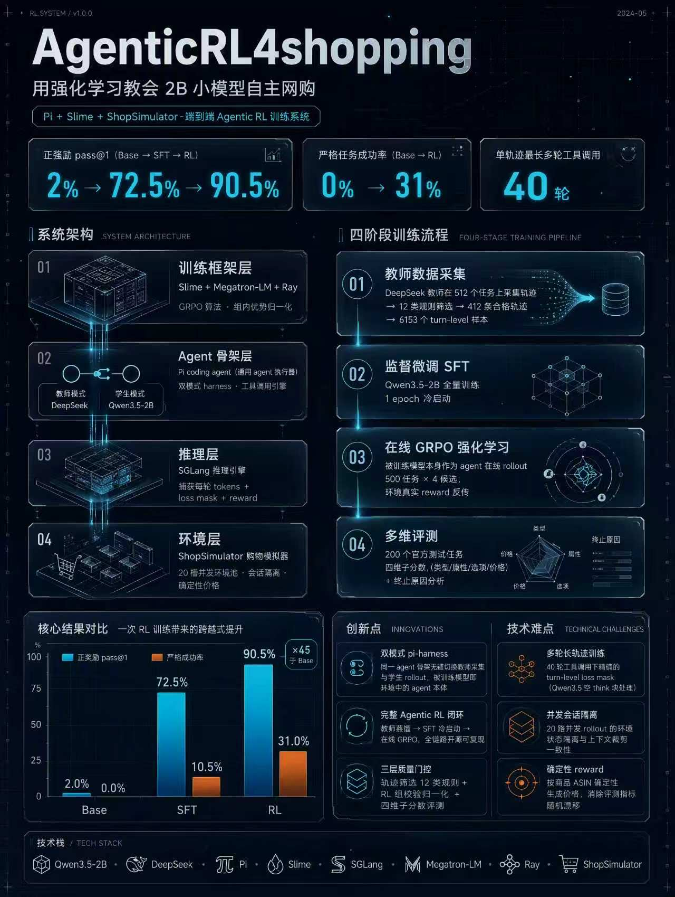

# 🛍️ SmartShop · 慧购

<div align="center">

[](LICENSE)
[](#)
[](#)
[](#)
[](#)

**用在线强化学习（GRPO）把 0.8B 小模型训练成自主购物 Agent**

</div>

基于 **Qwen3.5-0.8B + Pi Agent + Slime + ShopSimulator** 的最小训练参考实现，覆盖「512-task 教师数据采集 → 全量 SFT → 在线 GRPO → 单次 rollout 评测」的完整 agentic RL 流水线。仅用 0.8B 参数，在线 RL 后严格成功率从 19.0% 提升至 **34.0%**（+15pt）。



> **环境要求**：训练与评测需要 **Linux + NVIDIA GPU**（CUDA 12.9、PyTorch 2.11、SGLang、Megatron-LM）。macOS / Windows 无法运行训练流程，本地无 GPU 环境仅可浏览代码与结果。

---

## 📑 目录

- [✨ 项目亮点](#-项目亮点)
- [🧩 项目介绍与整体流程](#-项目介绍与整体流程)
- [📊 实验结果](#-实验结果)
- [🚀 快速开始](#-快速开始)
- [📦 安装与配置](assert/INSTALL.md)
- [⚖️ 许可与第三方](#️-许可与第三方)

---

## ✨ 项目亮点

- 🎯 **小模型，大提升**：0.8B 模型经在线 GRPO 后严格成功率 19.0% → 34.0%，验证了小规模模型在 agentic RL 任务上的可行性。
- 🧪 **完整四阶段流水线**：教师轨迹采集 → SFT → 在线 RL → 评测，全链路可复现。
- 🔀 **多算法对照**：在同一 SFT checkpoint 上对比 GRPO / Dr.GRPO / GSPO / CISPO / REINFORCE++。
- 🛡️ **三层质量门控**：采集期轨迹筛选、RL 期组校验归一化、评测期多维指标。
- ⚙️ **工程化隔离**：并发会话隔离、确定性价格、Qwen3.5 loss mask 等关键工程处理。

---

## 🧩 项目介绍与整体流程

### 这是什么项目

用在线强化学习（GRPO）把 Qwen3.5-0.8B 这样一个 0.8B 参数的小模型，训练成能在 ShopSimulator 购物模拟环境中自主完成购物任务的 Agent：模型通过 `shop_reset` / `shop_act` 两个工具与环境多轮交互（搜索、浏览、比价、下单），直到任务结束并获得环境反馈的 reward。

### 整体流程（四阶段）

```
阶段 1  教师数据采集（collect_sft.py + prepare_sft.py）
        DeepSeek 教师模型驱动 Pi agent 在 512 个任务上采集轨迹
        → 12 类规则筛选（reward 阈值 / 工具使用合法性 / 上下文轨迹一致性）
        → 通过筛选的轨迹展开为 turn-level SFT 样本
                │
                ▼
阶段 2  监督微调 SFT（run_sft.sh）
        Qwen3.5-0.8B 在 turn-level 样本上全量训练 1 epoch
                │
                ▼
阶段 3  在线强化学习 GRPO（run_rl.sh + generate.py）
        被训练的模型本身作为 agent 在环境中在线 rollout
        每个任务采样 4 个 candidate，组内归一化计算 advantage
                │
                ▼
阶段 4  评测（run_eval.sh + summarize_eval.py）
        在 official_test_200 上做 k=1 单次 rollout
        输出 r_loose / r_hard / 严格成功率 / pass@1 等指标
```

### 核心架构：pi-harness 的双模式

Pi（Node.js 编写的通用 coding agent CLI）在本项目中被当作通用的 agent 执行骨架使用：其内置编程工具被禁用，替换为 `shop_extension.ts` 注册的两个购物工具。同一套 harness（`pi_harness.py`）支持两种运行模式：

| 模式 | 使用场景 | 模型请求去向 |
| --- | --- | --- |
| 教师模式 | 阶段 1 数据采集 | DeepSeek API |
| 学生模式 | 阶段 3/4 RL rollout 与评测 | Slime OpenAI Adapter → SGLang → 被训练的 Qwen3.5-0.8B |

学生模式下，被训练的模型就是 rollout 中的 agent 本体：Slime 框架捕获每一轮的 tokens、loss mask 与最终 reward，直接用于 GRPO 策略梯度更新。

### 质量保障（三层门控）

1. **轨迹筛选（采集期）**：reward 阈值、运行错误、工具序列合法性（`shop_reset` 恰好一次且最先）、上下文轨迹与重建快照一致性等 12 类拒绝原因；
2. **组校验与归一化（RL 期）**：candidate 组完整性校验、reward 跨片段一致性、组内标准化与零方差检测；
3. **多维指标（评测期）**：`r_type` / `r_att` / `r_option` / `r_price` 四个子分数与终止原因分布。

### 关键工程点

- **会话隔离**：每条 rollout 持有独立 `rollout_session_id`，20 槽环境池并发隔离，防止 Slime 并发采样互相覆盖状态；
- **上下文一致性**：SFT 样本输入与 RL rollout 时模型实际上下文来自同一裁剪逻辑（保留最近 3 条 `shop_act` 结果），训练与部署分布对齐；
- **确定性价格**：ShopSimulator 补丁使商品价格按 ASIN 确定性生成，避免 reward 因服务端随机性漂移；
- **Qwen3.5 loss mask**：精确处理模板注入的空 think 块，多轮工具调用轨迹中只训练模型真实生成的 token。

## 📊 实验结果

以下为 **Qwen3.5-0.8B** 在本仓库流程下的评测结果（`official_test_200`，k=1 单次采样）。模型与数据产物暂未单独发布，全部结果可由本仓库工作流（实验 1–4）从基座模型完整复现。

### 核心指标对照

| 模型 | 正奖励 pass@1 | 严格成功 pass@1 | mean@1 `r_loose` | mean@1 `r_hard` |
| --- | ---: | ---: | ---: | ---: |
| Base | 0.0% | 0.0% | 0.000000 | 0.000000 |
| SFT | 69.5% | 19.0% | 0.443097 | 0.212067 |
| **GRPO** | 88.0% | **34.0%** | 0.638131 | 0.377048 |
| Dr.GRPO | 88.0% | 34.0% | 0.647307 | 0.387161 |
| GSPO | 89.0% | 33.5% | 0.639476 | 0.381073 |

> 算法变体（GRPO / Dr.GRPO / GSPO）之间的差异（±0.5pt）远小于评测噪声（CI ±3.3pt），**RL 本身才是 +15pt 的来源**。

### 完整指标表

| 模型 | 正奖励 pass@1 | 严格成功 | r_loose | r_hard | r_type | r_att | r_option | r_price | done 率 | 买对商品 | turn_limit 率 | 平均 turn 数 |
| --- | ---: | ---: | ---: | ---: | ---: | ---: | ---: | ---: | ---: | ---: | ---: | ---: |
| Base | 0.0% | 0.0% | 0.000000 | 0.000000 | 0.000000 | 0.000000 | 0.000000 | 0.000000 | 0.0% | 0.0% | 74.5% | 32.2 |
| SFT | 69.5% | 19.0% | 0.443097 | 0.212067 | 0.710000 | 0.472319 | 0.230000 | 0.595000 | 71.0% | 29.5% | 27.5% | 23.6 |
| GRPO | 88.0% | 34.0% | 0.638131 | 0.377048 | 0.905000 | 0.680938 | 0.408333 | 0.760000 | 90.5% | 40.5% | 9.0% | 13.3 |
| Dr.GRPO | 88.0% | 34.0% | 0.647307 | 0.387161 | 0.895000 | 0.681560 | 0.430000 | 0.780000 | 89.5% | 45.0% | 10.0% | 12.9 |
| GSPO | 89.0% | 33.5% | 0.639476 | 0.381073 | 0.910000 | 0.671067 | 0.413333 | 0.790000 | 91.0% | 41.0% | 9.0% | 14.3 |

> **解码方式与统计说明**：上表为 k=1、`temperature=1.0`、固定 rollout seed 的单次采样评测（非贪婪解码，也非多次运行均值——每个模型只运行一次）。n=200 下 90.5% 的 95% Wilson 置信区间约为 ±3.3%，小幅差距可能不具统计显著性。

### 进行中的工作 🚧

- **CISPO**、**REINFORCE++**：正在同一 SFT checkpoint 上训练与评测，结果完成后将补充至上表。

### 各阶段运行结果

| 阶段 | 运行结果 |
| --- | --- |
| 512-task 教师采集 | 512 个任务，采用过采样/补选确保**完整覆盖全部 512 个任务**（每任务 4-39 个 turn 样本，平均 13.9）；转换得到 **7128 个 turn-level SFT 样本**。 |
| SFT | **Qwen3.5-0.8B** 在 7128 个样本上完整训练 1 epoch，共 1782 个 optimizer step（`GLOBAL_BATCH_SIZE=4`、`MAX_TOKENS_PER_GPU=16384`）；生成 HF 与 Megatron checkpoint。 |
| 在线 GRPO | `rl_500` 训练 1 epoch：500 个 group、2000 个 candidate、100 个 rollout/optimizer step；352 个 group 具有非零 reward 方差。0.8B 已完整运行 100 rollout（中途从 `iter_0000049` 断点续训一次）。 |
| 算法对照 | 在同一 SFT checkpoint 上额外训练 Dr.GRPO（GRPO 去除 advantage 的 std 归一化）与 GSPO 两个变体（各 100 rollout），用于对比算法效率与效果。 |
| 最终评测 | 在 `official_test_200` 上对 Base、SFT、GRPO、Dr.GRPO、GSPO 各做 200 次单样本 rollout（解码：sampling, T=1.0, k=1）；结果见上表。 |

### 指标定义（依据 ShopSimulator 论文，arXiv:2601.18225）

环境在任务终止时返回四个子分数，本项目在此之上汇总出两级标量奖励：

| 子分数 | 定义 |
| --- | --- |
| `r_type` | 类别软匹配分：初始搜索一致 / 类别路径共享 ≥2 节点 / 标题关键词重合率 >0.2 三条判据任一满足取 1.0，否则 0.5；标题相似度过低降至 0.1 或 0 |
| `r_att` | 属性匹配率：购买商品语义属性（材质/功能/风格）与目标的匹配比例，模糊匹配且计入标题与描述 |
| `r_option` | 选项匹配率：配置选项（颜色/尺码/容量）与目标的匹配比例，模糊匹配 |
| `r_price` | 价格约束指示函数：购买价 ≤ 目标价格上限为 1，否则 0 |

- **`r_loose`（环境返回的标量 `reward`）**：加法奖励，
  `r_type × (|U_att∩Y_att| + |U_opt∩Y_opt| + 1[Y_price≤U_price]) / (|U_att| + |U_opt| + 1)`，
  其中 `U_*` 为目标商品的属性/选项集合与价格上限，`Y_*` 为购买商品的对应项。
  部分满足即可得部分奖励，取值 [0,1]。
- **`r_hard`（本仓库 `common.py` 计算）**：乘法奖励（论文的 strict 变体），
  `r_type × r_att × r_option × r_price` 四项连乘，任一维度不满足则整体趋零，
  与"严格成功"（四子项全 1）同向。

计算细节以 ShopSimulator 上游源码为准（本仓库不含其源码，见 [assert/THIRD_PARTY.md](assert/THIRD_PARTY.md)）。

---

## 🚀 快速开始

下面的命令按“512-task 教师数据采集 → 全量 SFT → `rl_500` GRPO → `official_test_200` 单次 rollout 评测”的顺序执行。

> 环境初始化与配置（克隆仓库、安装 Pi 与 Slime、获取并打补丁启动 ShopSimulator、准备 checkpoint）详见 [INSTALL.md](assert/INSTALL.md)。

### 实验 1：采集 `sft_512` 教师数据

教师采集默认读取仓库中的 `sft_512.jsonl`，每个任务采集一次，并使用 DeepSeek 兼容 API。创建一个文本文件，第一行写真实 API key（不要提交到仓库）：

```bash
export TEACHER_API_KEY_FILE="$THIRD_PARTY_ROOT/deepseek_api_key.txt"
chmod 600 "$TEACHER_API_KEY_FILE"

# 用文本编辑器把第一行写入真实 API key。
export SFT_DATA_ROOT=/absolute/path/to/runs/shop_sft_512

cd "$SLIME_DIR"
"$SLIME_PYTHON" -m examples.ShopSimulator.collect_sft \
  --output-dir "$SFT_DATA_ROOT" \
  --dry-run

PI_BIN="$PI_BIN" "$SLIME_PYTHON" -m examples.ShopSimulator.collect_sft \
  --output-dir "$SFT_DATA_ROOT" \
  --api-key-file "$TEACHER_API_KEY_FILE" \
  --model deepseek-v4-flash \
  --base-url https://api.deepseek.com \
  --env-url http://127.0.0.1:5000/api/shop_agent \
  --samples-per-task 1 \
  --concurrency 4
```

采集器会把每条原始轨迹写入 `$SFT_DATA_ROOT/raw/`，同一路径重跑时会跳过已有结果并继续未完成任务。采集结束后，将通过筛选的轨迹转换为独立的 turn-level SFT 样本：

```bash
cd "$SLIME_DIR"
"$SLIME_PYTHON" -m examples.ShopSimulator.prepare_sft \
  --input-dir "$SFT_DATA_ROOT" \
  --output-dir "$SFT_DATA_ROOT/prepared" \
  --tokenizer "$BASE_HF_CHECKPOINT" \
  --max-tokens 16384
```

检查 `$SFT_DATA_ROOT/summary.json`、`$SFT_DATA_ROOT/prepared/turn_examples_summary.json` 和最终的 `$SFT_DATA_ROOT/prepared/turn_examples.jsonl`。实际通过数量取决于教师输出，不要求等于历史运行的 412 条轨迹和 6153 个 turn。

### 实验 2：全量 SFT 训练 1 epoch

`run_sft.sh` 会读取 `turn_examples.jsonl` 的全部非空行，`NUM_DATA_PASSES=1` 表示完整训练一遍。默认参考实验使用 `GLOBAL_BATCH_SIZE=3`；它必须整除实际样本行数，不整除时应改为样本数的其他因数。

```bash
export SFT_RUN_ROOT=/absolute/path/to/runs/qwen35_2b_shop_sft

FULL_DATA="$SFT_DATA_ROOT/prepared/turn_examples.jsonl" \
HF_CHECKPOINT="$BASE_HF_CHECKPOINT" \
REF_MODEL_PATH="$BASE_MEGATRON_CHECKPOINT" \
RUN_ROOT="$SFT_RUN_ROOT" \
SLIME_PYTHON="$SLIME_PYTHON" \
MEGATRON_DIR="$MEGATRON_DIR" \
NUM_DATA_PASSES=1 \
GLOBAL_BATCH_SIZE=3 \
MAX_TOKENS_PER_GPU=12288 \
bash "$SLIME_DIR/examples/ShopSimulator/run_sft.sh"
```

`RUN_ROOT` 必须是尚不存在的新目录。训练完成后，HF export 位于 `$SFT_RUN_ROOT/hf/`，Megatron checkpoint 根目录为 `$SFT_RUN_ROOT/checkpoints/`。先查看实际生成的 HF 子目录，再为下一步设置路径：

```bash
find "$SFT_RUN_ROOT/hf" -mindepth 1 -maxdepth 1 -type d -print

export SFT_HF_CHECKPOINT=/absolute/path/to/the/generated/sft/hf/export
export SFT_MEGATRON_CHECKPOINT="$SFT_RUN_ROOT/checkpoints"
```

### 实验 3：使用 `rl_500` 训练 GRPO 1 epoch

默认 `config/shop_rl.json` 已配置 500 个任务、每题 4 个 candidate、rollout batch size 5 和 1 epoch。RL 必须从上一步相互匹配的 SFT HF/Megatron checkpoint 启动。

```bash
export RL_RUN_ROOT=/absolute/path/to/runs/qwen35_2b_shop_rl

HF_CHECKPOINT="$SFT_HF_CHECKPOINT" \
REF_MODEL_PATH="$SFT_MEGATRON_CHECKPOINT" \
RUN_ROOT="$RL_RUN_ROOT" \
SLIME_PYTHON="$SLIME_PYTHON" \
MEGATRON_DIR="$MEGATRON_DIR" \
PI_BIN="$PI_BIN" \
SHOP_ENV_URL=http://127.0.0.1:5000/api/shop_agent \
MAX_TOKENS_PER_GPU=12288 \
SGLANG_MEM_FRACTION_STATIC=0.55 \
bash "$SLIME_DIR/examples/ShopSimulator/run_rl.sh"
```

训练完成后，HF export 位于 `$RL_RUN_ROOT/hf/`，Megatron checkpoint 根目录为 `$RL_RUN_ROOT/checkpoints/`。同样以实际生成的 HF 子目录为准：

```bash
find "$RL_RUN_ROOT/hf" -mindepth 1 -maxdepth 1 -type d -print

export RL_HF_CHECKPOINT=/absolute/path/to/the/generated/rl/hf/export
export RL_MEGATRON_CHECKPOINT="$RL_RUN_ROOT/checkpoints"
```

### 实验 4：在 `official_test_200` 上做 k=1 评测

`shop_eval_official_k1.yaml` 对 200 个任务各 rollout 1 次。若要比较 Base、SFT 和 RL，按顺序运行下面三个命令；每次运行都会独立启动并清理 Ray，因此不要并行执行。

```bash
export BASE_EVAL_ROOT=/absolute/path/to/runs/eval_base_k1
EVAL_CHECKPOINT="$BASE_MEGATRON_CHECKPOINT" \
HF_CHECKPOINT="$BASE_HF_CHECKPOINT" \
RUN_ROOT="$BASE_EVAL_ROOT" \
SLIME_PYTHON="$SLIME_PYTHON" \
MEGATRON_DIR="$MEGATRON_DIR" \
PI_BIN="$PI_BIN" \
bash "$SLIME_DIR/examples/ShopSimulator/run_eval.sh"

export SFT_EVAL_ROOT=/absolute/path/to/runs/eval_sft_k1
EVAL_CHECKPOINT="$SFT_MEGATRON_CHECKPOINT" \
HF_CHECKPOINT="$SFT_HF_CHECKPOINT" \
RUN_ROOT="$SFT_EVAL_ROOT" \
SLIME_PYTHON="$SLIME_PYTHON" \
MEGATRON_DIR="$MEGATRON_DIR" \
PI_BIN="$PI_BIN" \
bash "$SLIME_DIR/examples/ShopSimulator/run_eval.sh"

export RL_EVAL_ROOT=/absolute/path/to/runs/eval_rl_k1
EVAL_CHECKPOINT="$RL_MEGATRON_CHECKPOINT" \
HF_CHECKPOINT="$RL_HF_CHECKPOINT" \
RUN_ROOT="$RL_EVAL_ROOT" \
SLIME_PYTHON="$SLIME_PYTHON" \
MEGATRON_DIR="$MEGATRON_DIR" \
PI_BIN="$PI_BIN" \
bash "$SLIME_DIR/examples/ShopSimulator/run_eval.sh"
```

每次评测的完整结果分别写入对应 `RUN_ROOT/eval_results.json`，其中包含 `r_loose`、`r_hard`、严格成功率、正奖励 pass@1、终止原因和逐任务记录。这里只运行评测，不会更新模型权重。

## ⚖️ 许可与第三方

ShopSimulator 上游当前未声明明确的软件再分发许可证，因此本临时结构不包含其完整源码。来源、固定 revision 和许可证状态见 [assert/THIRD_PARTY.md](assert/THIRD_PARTY.md)。

根目录 MIT License 仅覆盖本项目有权许可的原创代码和文档，不会改变第三方组件的许可证。内置 Slime 快照继续遵循 `slime/LICENSE` 中的 Apache-2.0；ShopSimulator 补丁也不授予对其上游源码的额外权利。

模型权重、大型训练数据、原始日志和 rollout dump 不进入 GitHub 仓库。两套训练后的 HF 模型已通过本文开头列出的公开 Hugging Face 仓库提供；历史 SFT 数据集为私有归档，原始日志和 rollout dump 不对外发布。
