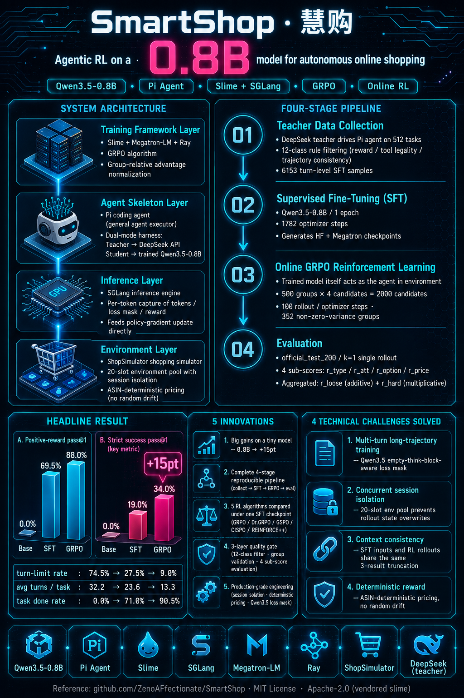
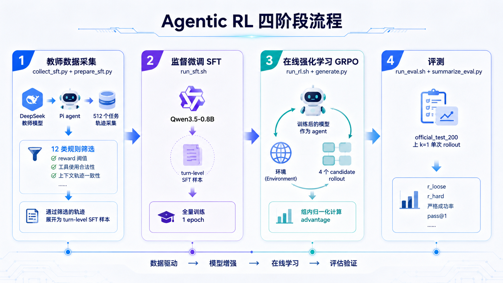

# 🛍️ SmartShop · 慧购

<div align="center">

[](LICENSE)
[](#)
[](#)
[](#)
[](#)

**用在线强化学习（GRPO）把 0.8B 小模型训练成自主购物 Agent**

</div>

基于 **Qwen3.5-0.8B + Pi Agent + Slime + ShopSimulator** 的最小训练参考实现，覆盖「512-task 教师数据采集 → 全量 SFT → 在线 GRPO → 单次 rollout 评测」的完整 agentic RL 流水线。仅用 0.8B 参数，在线 RL 后严格成功率从 19.0% 提升至 **34.0%**（+15pt）。



> **环境要求**：训练与评测需要 **Linux + NVIDIA GPU**（CUDA 12.9、PyTorch 2.11、SGLang、Megatron-LM）。macOS / Windows 无法运行训练流程，本地无 GPU 环境仅可浏览代码与结果。

---

## 📑 目录

- [✨ 项目亮点](#-项目亮点)
- [🧩 项目介绍与整体流程](#-项目介绍与整体流程)
- [📊 实验结果](#-实验结果)
- [🧠 结构化记忆（R5）](#-结构化记忆r5)
- [🚀 快速开始](#-快速开始)
- [📦 安装与配置](assert/INSTALL.md)
- [⚖️ 许可与第三方](#️-许可与第三方)

---

## ✨ 项目亮点

- 🎯 **小模型，大提升**：0.8B 模型经在线 GRPO 后严格成功率 19.0% → 34.0%，验证了小规模模型在 agentic RL 任务上的可行性。
- 🧪 **完整四阶段流水线**：教师轨迹采集 → SFT → 在线 RL → 评测，全链路可复现。
- 🔀 **多算法对照**：在同一 SFT checkpoint 上对比 GRPO / Dr.GRPO / GSPO / DAPO / CISPO / REINFORCE++。
- 🛡️ **三层质量门控**：采集期轨迹筛选、RL 期组校验归一化、评测期多维指标。
- 🧠 **结构化记忆（R5）**：把裁剪掉的历史工具结果压缩成一行行结构化记忆，让模型始终记得"搜过什么、看过什么、什么价"。**turn_limit 率 27.5% → 4.5%、平均轮数 −62%、正奖励 pass@1 +21.5pt，严格成功率不降**——本项目唯一同时改善效率与质量的上下文机制（[详见](#-结构化记忆r5)）。
- ⚙️ **工程化隔离**：并发会话隔离、确定性价格、Qwen3.5 loss mask 等关键工程处理。

---

## 🧩 项目介绍与整体流程

### 这是什么项目

用在线强化学习（GRPO）把 Qwen3.5-0.8B 这样一个 0.8B 参数的小模型，训练成能在 ShopSimulator 购物模拟环境中自主完成购物任务的 Agent：模型通过 `shop_reset` / `shop_act` 两个工具与环境多轮交互（搜索、浏览、比价、下单），直到任务结束并获得环境反馈的 reward。

### 整体流程（四阶段）



### 核心架构：pi-harness 的双模式

Pi（Node.js 编写的通用 coding agent CLI）在本项目中被当作通用的 agent 执行骨架使用：其内置编程工具被禁用，替换为 `shop_extension.ts` 注册的两个购物工具。同一套 harness（`pi_harness.py`）支持两种运行模式：

| 模式 | 使用场景 | 模型请求去向 |
| --- | --- | --- |
| 教师模式 | 阶段 1 数据采集 | DeepSeek API |
| 学生模式 | 阶段 3/4 RL rollout 与评测 | Slime OpenAI Adapter → SGLang → 被训练的 Qwen3.5-0.8B |

学生模式下，被训练的模型就是 rollout 中的 agent 本体：Slime 框架捕获每一轮的 tokens、loss mask 与最终 reward，直接用于 GRPO 策略梯度更新。

### 质量保障（三层门控）

1. **轨迹筛选（采集期）**：reward 阈值、运行错误、工具序列合法性（`shop_reset` 恰好一次且最先）、上下文轨迹与重建快照一致性等 12 类拒绝原因；
2. **组校验与归一化（RL 期）**：candidate 组完整性校验、reward 跨片段一致性、组内标准化与零方差检测；
3. **多维指标（评测期）**：`r_type` / `r_att` / `r_option` / `r_price` 四个子分数与终止原因分布。

### 关键工程点

- **会话隔离**：每条 rollout 持有独立 `rollout_session_id`，20 槽环境池并发隔离，防止 Slime 并发采样互相覆盖状态；
- **上下文一致性**：SFT 样本输入与 RL rollout 时模型实际上下文来自同一裁剪逻辑（最近 3 条 `shop_act` 结果保留完整原文，更早的压成候选摘要行——asin/标题/价格/店铺/选项，受 2400 字符总预算约束），训练与部署分布对齐；
- **确定性价格**：ShopSimulator 补丁使商品价格按 ASIN 确定性生成，避免 reward 因服务端随机性漂移；
- **Qwen3.5 loss mask**：精确处理模板注入的空 think 块，多轮工具调用轨迹中只训练模型真实生成的 token。

## 📊 实验结果

以下为 **Qwen3.5-0.8B** 在本仓库流程下的评测结果（`official_test_200`，k=1 单次采样）。模型与数据产物暂未单独发布，全部结果可由本仓库工作流（实验 1–4）从基座模型完整复现。

### 核心指标对照

| 模型 | 正奖励 pass@1 | 严格成功 | 买对商品 | mean@1 `r_loose` | mean@1 `r_hard` | done 率 | turn_limit 率 | 平均 turn 数 |
| --- | ---: | ---: | ---: | ---: | ---: | ---: | ---: | ---: |
| Base | 0.0% | 0.0% | 0.0% | 0.000000 | 0.000000 | 0.0% | 74.5% | 32.2 |
| SFT | 69.5% | 19.0% | 29.5% | 0.443097 | 0.212067 | 71.0% | 27.5% | 23.6 |
| GRPO | 88.0% | <u>34.0%</u> | 40.5% | 0.638131 | 0.377048 | 90.5% | 9.0% | 13.3 |
| Dr.GRPO | 88.0% | <u>34.0%</u> | <u>45.0%</u> | 0.647307 | <u>0.387161</u> | 89.5% | 10.0% | <u>12.9</u> |
| GSPO | 89.0% | 33.5% | 41.0% | 0.639476 | 0.381073 | 91.0% | 9.0% | 14.3 |
| REINFORCE++ | <u>92.5%</u> | <u>34.0%</u> | 42.5% | <u>0.670064</u> | 0.384583 | <u>95.5%</u> | <u>4.5%</u> | **9.9** |
| CISPO | 86.0% | **39.0%** | **47.5%** | 0.652138 | **0.423274** | 86.5% | 13.5% | 16.9 |
| DAPO | **95.5%** | 31.0% | 43.0% | **0.670775** | 0.356946 | **97.0%** | **3.0%** | 10.9 |

> **解码方式与统计说明**：k=1、`temperature=1.0`、固定 rollout seed 的单次采样评测（非贪婪解码，也非多次运行均值——每个模型只运行一次）。n=200 下 90.5% 的 95% Wilson 置信区间约为 ±3.3%，小幅差距可能不具统计显著性。六个算法变体的严格成功率差异（31.0%–39.0%，CISPO 名义最高）处于该噪声范围内，**RL 本身才是 +15pt 的来源**。表中**加粗**为该列最优、<u>下划线</u>为该列次优（并列时一并标注）；`turn_limit 率`与`平均 turn 数`为越低越好。**done 率** = 预算内走完任务流程的比例；**买对商品** = `purchase_asin == goal_asin` 的比例（严格成功的必要非充分条件）；**严格成功** = 四个子分数全 1（r_hard=1）。

### 各阶段运行结果

| 阶段 | 运行结果 |
| --- | --- |
| 512-task 教师采集 | 512 个任务，采用过采样/补选确保**完整覆盖全部 512 个任务**（每任务 4-39 个 turn 样本，平均 13.9）；转换得到 **7128 个 turn-level SFT 样本**。 |
| SFT | **Qwen3.5-0.8B** 在 7128 个样本上完整训练 1 epoch，共 1782 个 optimizer step（`GLOBAL_BATCH_SIZE=4`、`MAX_TOKENS_PER_GPU=16384`）；生成 HF 与 Megatron checkpoint。 |
| 在线 GRPO | `rl_500` 训练 1 epoch：500 个 group、2000 个 candidate、100 个 rollout/optimizer step；352 个 group 具有非零 reward 方差。0.8B 已完整运行 100 rollout（中途从 `iter_0000049` 断点续训一次）。 |
| 算法对照 | 在同一 SFT checkpoint 上额外训练 Dr.GRPO（去除 advantage 的 std 归一化）、GSPO、REINFORCE++、CISPO、DAPO 五个变体（各 100 rollout），用于对比算法效率与效果。 |
| 最终评测 | 在 `official_test_200` 上对 Base、SFT 及六个 RL 算法 checkpoint 各做 200 次单样本 rollout（解码：sampling, T=1.0, k=1）；结果见上表。 |

### 指标定义（依据 ShopSimulator 论文，arXiv:2601.18225）

环境在任务终止时返回四个子分数，本项目在此之上汇总出两级标量奖励：

| 子分数 | 定义 |
| --- | --- |
| `r_type` | 类别软匹配分：初始搜索一致 / 类别路径共享 ≥2 节点 / 标题关键词重合率 >0.2 三条判据任一满足取 1.0，否则 0.5；标题相似度过低降至 0.1 或 0 |
| `r_att` | 属性匹配率：购买商品语义属性（材质/功能/风格）与目标的匹配比例，模糊匹配且计入标题与描述 |
| `r_option` | 选项匹配率：配置选项（颜色/尺码/容量）与目标的匹配比例，模糊匹配 |
| `r_price` | 价格约束指示函数：购买价 ≤ 目标价格上限为 1，否则 0 |

- **`r_loose`（环境返回的标量 `reward`）**：加法奖励，
  `r_type × (|U_att∩Y_att| + |U_opt∩Y_opt| + 1[Y_price≤U_price]) / (|U_att| + |U_opt| + 1)`，
  其中 `U_*` 为目标商品的属性/选项集合与价格上限，`Y_*` 为购买商品的对应项。
  部分满足即可得部分奖励，取值 [0,1]。
- **`r_hard`（本仓库 `common.py` 计算）**：乘法奖励（论文的 strict 变体），
  `r_type × r_att × r_option × r_price` 四项连乘，任一维度不满足则整体趋零，
  与"严格成功"（四子项全 1）同向。

计算细节以 ShopSimulator 上游源码为准（本仓库不含其源码，见 [assert/THIRD_PARTY.md](assert/THIRD_PARTY.md)）。

#### 完整指标表（购买质量子分数）

> 各模型在四个购买质量维度上的得分，及其经加/乘聚合得到的 `r_loose` / `r_hard`。

| 模型 | r_type | r_att | r_option | r_price | r_loose | r_hard |
| --- | ---: | ---: | ---: | ---: | ---: | ---: |
| Base | 0.000000 | 0.000000 | 0.000000 | 0.000000 | 0.000000 | 0.000000 |
| SFT | 0.710000 | 0.472319 | 0.230000 | 0.595000 | 0.443097 | 0.212067 |
| GRPO | 0.905000 | 0.680938 | 0.408333 | 0.760000 | 0.638131 | 0.377048 |
| Dr.GRPO | 0.895000 | 0.681560 | <u>0.430000</u> | 0.780000 | 0.647307 | <u>0.387161</u> |
| GSPO | 0.910000 | 0.671067 | 0.413333 | 0.790000 | 0.639476 | 0.381073 |
| REINFORCE++ | <u>0.955000</u> | **0.719292** | 0.432500 | <u>0.800000</u> | <u>0.670064</u> | 0.384583 |
| CISPO | 0.865000 | 0.686244 | **0.458333** | 0.755000 | 0.652138 | **0.423274** |
| DAPO | **0.970000** | <u>0.715076</u> | 0.398333 | **0.835000** | **0.670775** | 0.356946 |

> **加粗**为该列最优、<u>下划线</u>为该列次优（并列时一并标注）。

### 分级奖励优化对照（R1-2 分解优势 + R3-2 行为分）

> 在各算法的优势计算层叠加两项分级奖励优化后，于**同一 SFT checkpoint** 上重新训练 100 rollout 并以完全相同的配置（`official_test_200`，k=1，T=1.0）重新评测的结果，用于与上表基线逐一对照：
>
> - **R1-2 多维分解优势**（`SHOP_DECOMPOSED_ADVANTAGE_WEIGHT=0.5`）：`r_type/r_att/r_option/r_price` 四个子分数在组内各自标准化后按权重与标量优势混合，使"标量奖励相同但子分数有差异"的组也能产生梯度；
> - **R3-2 行为过程奖励**（`SHOP_BEHAVIOR_DELTA=0.05`）：先浏览 goal 商品详情页再购买 +δ，重复动作（搜索死循环）−δ。
>
> 复现方式：`ALGORITHM=<algo> RUN_TAG=_r12r32 SHOP_DECOMPOSED_ADVANTAGE_WEIGHT=0.5 SHOP_BEHAVIOR_DELTA=0.05 bash run_rl.sh`（训练 + 自动评测）。

| 模型（+R1-2/R3-2） | 正奖励 pass@1 | 严格成功 | 买对商品 | mean@1 `r_loose` | mean@1 `r_hard` | done 率 | turn_limit 率 | 平均 turn 数 |
| --- | ---: | ---: | ---: | ---: | ---: | ---: | ---: | ---: |
| CISPO | **92.0%** | 36.0% | **45.0%** | **0.664277** | 0.396548 | **93.0%** | **7.0%** | 13.9 |
| GRPO | 88.5% | 35.5% | 43.5% | 0.643929 | 0.387518 | 90.5% | 9.5% | 15.5 |
| Dr.GRPO | 80.5% | **36.5%** | 44.0% | 0.615282 | **0.403524** | 82.0% | 16.5% | 17.1 |
| GSPO | <u>91.5%</u> | 33.0% | 42.0% | 0.647311 | 0.365417 | <u>92.5%</u> | <u>7.5%</u> | **13.0** |
| REINFORCE++ | 89.0% | <u>35.5%</u> | <u>44.5%</u> | <u>0.659285</u> | 0.393583 | 90.5% | 9.0% | 13.7 |
| DAPO | 88.5% | 33.0% | <u>44.5%</u> | 0.649293 | 0.365952 | 92.0% | 8.0% | 14.5 |
| CISPO（r_hard 训练信号） | 83.5% | 35.5% | 41.5% | 0.622861 | 0.394792 | 85.0% | 15.0% | 15.7 |

> **与基线 CISPO 的对比**（同解码配置单次采样）：done 率 86.5%→**93.0%**、turn_limit 率 13.5%→**7.0%**、平均 turn 数 16.9→**13.9**、正奖励 pass@1 86.0%→**92.0%**——效率与完成率维度显著改善（R3-2 直接惩罚重复动作死循环）；严格成功 39.0%→36.0% 名义下降，但 95% CI [29.7%, 42.9%] 内**统计上不可区分**。评测耗时同步从约 10 分钟降至 5 分 44 秒（轨迹更短）。
>
> **与基线 GRPO / Dr.GRPO / GSPO 的对比**：GRPO 严格成功 34.0%→35.5%、买对商品 40.5%→43.5% 小幅改善；GSPO 严格成功 33.5%→33.0% 持平、pass@1 89.0%→91.5% 与效率维度（done 91.0%→92.5%、turn_limit 9.0%→7.5%）小幅改善；Dr.GRPO 严格成功 34.0%→36.5% 但正奖励 pass@1 88.0%→80.5%、done 率 89.5%→82.0%、turn_limit 率 10.0%→16.5% 明显走弱——R3-2 的行为塑形并非对所有 estimator 都单向有利，Dr.GRPO（去除 std 归一化）与分解优势叠加后表现出退化。以上均为单次采样，n=200 下 Wilson 95% CI 约 ±3.3%，需多 seed 复核后再下结论。
>
> **与基线 REINFORCE++ / DAPO 的对比（效率换质量模式）**：REINFORCE++ 基线是效率之王（done 95.5%、turn_limit 4.5%、9.9 turns），优化后严格成功 34.0%→35.5%、买对商品 42.5%→44.5%、`r_loose` 0.670→0.659 基本持平，但效率明显回落（done 90.5%、turn_limit 9.0%、13.7 turns）；DAPO 同样（严格成功 31.0%→33.0% 改善，pass@1 95.5%→88.5%、done 97.0%→92.0% 回落）。跨六个算法的整体图景：**R3-2 行为塑形统一把各算法拉向"更稳但更长的轨迹"**——基线效率越高的算法回落越明显，而基线效率低、质量高的 CISPO 获得了纯收益（效率与质量双升，综合排名第一）。严格成功五算法区间 33.0%–36.5% 仍处单次采样噪声带内。
>
> **评测执行说明**：五组评测的 rollout 均完整跑完（200/200）；其中 REINFORCE++ 因 Ray dashboard 的 metrics 子模块受 **AF_UNIX socket 路径长度（≤107 字节）限制**无法启动、DAPO 因 job status 查询抖动各重试/补汇总一次，结果数据本身无损（详见 `result/rl/` 下各评测日志）。两个脚本现已加入 temp-dir 长度 fail-fast 校验防复发。
>
> **r_hard 训练信号消融（最后一行的 CISPO）**：在完全相同的 R1-2+R3-2 配置下，仅把训练 reward 从环境标量 `r_loose` 换成乘法 `r_hard`（`SHOP_REWARD_METRIC=hard`，四子分数连乘），**未能提升目标指标**：严格成功 36.0%→35.5%、`r_hard` 0.3965→0.3948（实质持平，95% CI 内），且其余维度全面走弱——pass@1 92.0%→83.5%、买对 45.0%→41.5%、done 93.0%→85.0%、turn_limit 7.0%→15.0%。两组零方差组比例实测接近（9% vs 8%），因此**不是"信号稀疏导致无梯度组暴增"**；更可能是乘法奖励对"部分满足"惩罚过重（如 r_att=0.5、r_option=0.5 时 r_hard 仅 0.25 而 r_loose 为 0.417），使梯度方向偏离"逐步完成度"，训练效率回落（turn_limit 回到 15%，接近无优化基线 13.5%）。**结论：对齐评测指标 ≠ 更适合做训练信号；在本任务上加法奖励（配合 R1-2 分解优势提供的细粒度信息）仍是更优的 RL 信号**。

---

## 🧠 结构化记忆（R5）

> **一句话**：把被裁掉的历史工具结果，从「空白占位符」换成「一行行结构化记忆」，让模型始终记得自己搜过什么、看过什么、什么价——这是本项目中**唯一同时提升效率与质量**的上下文机制。

### 它解决什么问题

agentic 购物轨迹最长 40 轮，每轮 `shop_act` 都返回整页解析文本（数百至上千字符）。把全部历史原样喂给模型会撑爆 16k 上下文，因此必须裁剪。但**裁剪方式决定成败**：

| 裁剪策略 | 后果 |
|---|---|
| 保留全部原文 | 上下文爆炸，超出窗口 |
| 折叠成空白占位符（R5 之前） | 模型失去"我已经搜过什么"的记忆 → **反复搜索同一个关键词** → 40 轮耗尽（`turn_limit`） |
| **结构化记忆（R5，本方案）** | 历史压缩为一行行可读记忆 → 模型知道搜过/看过什么 → **不再重复搜索** |

关键洞察：`turn_limit` 轨迹的**直接成因就是重复动作死循环**。行为惩罚（R3-2）只能事后惩罚，结构化记忆则从根上避免。

### 三层机制

**1. 逐条压缩**（`summarize_shop_act_result`）——按页面类型提取决策要点：

| 页面类型 | 压缩结果（示例） |
|---|---|
| 搜索结果 | `[记忆] search[美容镜] 150件: 824148419972\|折叠led浴室镜\|288.0 to 338.0; …`（最多保留 4 个候选） |
| 商品详情 | `[记忆] view[824148419972] 折叠led浴室镜酒店壁挂 \| 价格: 288.0 to 338.0 \| 店铺: 格瑞达家居旗舰店 \| 颜色分类: 黑色…, 银色…` |
| 购买成功 | `[记忆] buy✓ asin=824148419972 options=黑色 明装插电款…` |
| 其他页面 | `[记忆] act: <首个有效行>`（兜底，≤60 字符） |

**2. 预算控制**（`build_memory_lines`）：所有记忆行共享 **2400 字符**总预算，从**最新向旧**消费；装不下的旧条目折叠为 `[该结果已折叠；详见上方记忆条目]`。**无论轨迹多长，上下文增长都有界**。

**3. 保留最近 N 条原文**：最近 3 条（`SHOP_CONTEXT_KEEP_ACT_RESULTS`）工具结果保持**完整原文**，仅更早的才压缩——模型对"当前正在看的那个页面"始终拥有全量信息。

### 工程关键：跨语言逐字节一致

同一套压缩逻辑存在**两份实现**，必须产出**完全相同**的字符串：

| 实现 | 文件 | 使用场景 |
|---|---|---|
| TypeScript | `slime/examples/ShopSimulator/shop_memory.ts` | **RL rollout 时**：Pi extension 在每个请求发出前重写上下文（`shop_extension.ts` 的 `context` hook） |
| Python | `slime/examples/ShopSimulator/shop_memory.py` | **SFT 数据管线**：`collect_sft.context_snapshots` 按同样规则重建上下文 |

原因：本项目的核心质量门是**训练/部署分布对齐**——SFT 样本里的上下文必须与 RL rollout 时模型真实看到的上下文一致；任何一侧的静默漂移都会造成训练与推理错配，且极难事后发现。

一致性由 `tests/test_shopsimulator/test_shop_memory.py` 强制保证：用 **Node 执行 TS 模块**，在共享 fixture（13 条样本，含 `null` / 数组 / 整数样式键等 JSON 边界情形）上与 Python 输出**逐字节比对**。

### 实测效果（同一 SFT 起点、`official_test_200`、k=1、T=1.0）

| 指标 | 关闭（旧 SFT） | **开启（新 SFT）** | 变化 |
|---|---:|---:|---:|
| **done 率** | 71.0% | **95.5%** | **+24.5pt** |
| **turn_limit 率** | 27.5% | **4.5%** | **−23.0pt** |
| **平均 turn 数** | 23.64 | **8.94** | **−62%** |
| 正奖励 pass@1 | 69.5% | **91.0%** | +21.5pt |
| `r_loose` / `r_hard` | 0.4431 / 0.2121 | **0.5705 / 0.2396** | +0.127 / +0.028 |
| 严格成功 | 19.0% | 21.0% | +2.0pt（CI 内，不显著） |

**turn_limit 从 27.5% 砍到 4.5%**——这正是"模型不再遗忘自己搜过什么"的直接证据；同时严格成功率未退化，说明压缩没有丢失决策所需信息（评测耗时也从约 10 分钟降到 4 分 27 秒）。

### 开关与复现

```bash
SHOP_CONTEXT_STRUCTURED_MEMORY=1   # 默认开启；=0 回退为旧的空白占位符行为
SHOP_CONTEXT_KEEP_ACT_RESULTS=3    # 保留最近 N 条完整结果（更早的压缩为记忆行）
```

复现上表：`collect_sft` 采集（默认即开启）→ `run_sft.sh` 重训 → `run_eval.sh` 评测，命令见下文实验步骤。

---

## 🚀 快速开始

下面的命令按“512-task 教师数据采集 → 全量 SFT → `rl_500` GRPO → `official_test_200` 单次 rollout 评测”的顺序执行。

> 环境初始化与配置（克隆仓库、安装 Pi 与 Slime、获取并打补丁启动 ShopSimulator、准备 checkpoint）详见 [INSTALL.md](assert/INSTALL.md)。

### 实验 1：采集 `sft_512` 教师数据

教师采集默认读取仓库中的 `sft_512.jsonl`，每个任务采集一次，并使用 DeepSeek 兼容 API。创建一个文本文件，第一行写真实 API key（不要提交到仓库）：

```bash
export TEACHER_API_KEY_FILE="$THIRD_PARTY_ROOT/deepseek_api_key.txt"
chmod 600 "$TEACHER_API_KEY_FILE"

# 用文本编辑器把第一行写入真实 API key。
# 本项目实际使用（数据盘）。必须是一个全新目录：采集器会校验已有轨迹的教师指纹，
# 指向含历史教师数据（如 deepseek-v4-flash 时期）的目录会被拒绝。
export SFT_DATA_ROOT=/hdd/kemove/slime-runs/sft_flash_mem

cd "$SLIME_DIR"
"$SLIME_PYTHON" -m examples.ShopSimulator.collect_sft \
  --output-dir "$SFT_DATA_ROOT" \
  --dry-run

SHOP_CONTEXT_STRUCTURED_MEMORY=1 \
PI_BIN="$PI_BIN" "$SLIME_PYTHON" -m examples.ShopSimulator.collect_sft \
  --output-dir "$SFT_DATA_ROOT" \
  --api-key-file "$TEACHER_API_KEY_FILE" \
  --model deepseek-flash \
  --base-url https://api.deepseek.com \
  --env-url http://127.0.0.1:5000/api/shop_agent \
  --samples-per-task 1 \
  --concurrency 4
```

> 换教师模型或上下文格式重采时，请使用**新的** `--output-dir`：采集器会校验已有轨迹的
> `teacher`/`harness` 指纹（模型、base-url、上下文裁剪与记忆格式），不一致默认报错终止，
> 避免一个数据集静默混入两代教师数据。确需混采时显式加 `--allow-mixed-teacher`，
> 此时 `summary.json` 会记录 `teacher_models_seen` 集合。

采集器会把每条原始轨迹写入 `$SFT_DATA_ROOT/raw/`，同一路径重跑时会跳过已有结果并继续未完成任务。采集结束后，将通过筛选的轨迹转换为独立的 turn-level SFT 样本：

```bash
cd "$SLIME_DIR"
"$SLIME_PYTHON" -m examples.ShopSimulator.prepare_sft \
  --input-dir "$SFT_DATA_ROOT" \
  --output-dir "$SFT_DATA_ROOT/prepared" \
  --tokenizer "$BASE_HF_CHECKPOINT" \
  --max-tokens 16384
```

检查 `$SFT_DATA_ROOT/summary.json`、`$SFT_DATA_ROOT/prepared/turn_examples_summary.json` 和最终的 `$SFT_DATA_ROOT/prepared/turn_examples.jsonl`。实际通过数量取决于教师输出，不要求等于历史运行的 412 条轨迹和 6153 个 turn。

### 实验 2：全量 SFT 训练 1 epoch

`run_sft.sh` 会读取 `turn_examples.jsonl` 的全部非空行，`NUM_DATA_PASSES=1` 表示完整训练一遍。默认参考实验使用 `GLOBAL_BATCH_SIZE=3`；它必须整除实际样本行数，不整除时应改为样本数的其他因数。

```bash
export SFT_RUN_ROOT=/absolute/path/to/runs/qwen35_2b_shop_sft

FULL_DATA="$SFT_DATA_ROOT/prepared/turn_examples.jsonl" \
HF_CHECKPOINT="$BASE_HF_CHECKPOINT" \
REF_MODEL_PATH="$BASE_MEGATRON_CHECKPOINT" \
RUN_ROOT="$SFT_RUN_ROOT" \
SLIME_PYTHON="$SLIME_PYTHON" \
MEGATRON_DIR="$MEGATRON_DIR" \
NUM_DATA_PASSES=1 \
GLOBAL_BATCH_SIZE=3 \
MAX_TOKENS_PER_GPU=12288 \
bash "$SLIME_DIR/examples/ShopSimulator/run_sft.sh"
```

`RUN_ROOT` 必须是尚不存在的新目录。训练完成后，HF export 位于 `$SFT_RUN_ROOT/hf/`，Megatron checkpoint 根目录为 `$SFT_RUN_ROOT/checkpoints/`。先查看实际生成的 HF 子目录，再为下一步设置路径：

```bash
find "$SFT_RUN_ROOT/hf" -mindepth 1 -maxdepth 1 -type d -print

export SFT_HF_CHECKPOINT=/absolute/path/to/the/generated/sft/hf/export
export SFT_MEGATRON_CHECKPOINT="$SFT_RUN_ROOT/checkpoints"
```

### 实验 3：使用 `rl_500` 训练 GRPO 1 epoch

默认 `config/shop_rl.json` 已配置 500 个任务、每题 4 个 candidate、rollout batch size 5 和 1 epoch。RL 必须从上一步相互匹配的 SFT HF/Megatron checkpoint 启动。

```bash
export RL_RUN_ROOT=/absolute/path/to/runs/qwen35_2b_shop_rl

HF_CHECKPOINT="$SFT_HF_CHECKPOINT" \
REF_MODEL_PATH="$SFT_MEGATRON_CHECKPOINT" \
RUN_ROOT="$RL_RUN_ROOT" \
SLIME_PYTHON="$SLIME_PYTHON" \
MEGATRON_DIR="$MEGATRON_DIR" \
PI_BIN="$PI_BIN" \
SHOP_ENV_URL=http://127.0.0.1:5000/api/shop_agent \
MAX_TOKENS_PER_GPU=12288 \
SGLANG_MEM_FRACTION_STATIC=0.55 \
bash "$SLIME_DIR/examples/ShopSimulator/run_rl.sh"
```

训练完成后，HF export 位于 `$RL_RUN_ROOT/hf/`，Megatron checkpoint 根目录为 `$RL_RUN_ROOT/checkpoints/`。同样以实际生成的 HF 子目录为准：

```bash
find "$RL_RUN_ROOT/hf" -mindepth 1 -maxdepth 1 -type d -print

export RL_HF_CHECKPOINT=/absolute/path/to/the/generated/rl/hf/export
export RL_MEGATRON_CHECKPOINT="$RL_RUN_ROOT/checkpoints"
```

### 实验 4：在 `official_test_200` 上做 k=1 评测

`shop_eval_official_k1.yaml` 对 200 个任务各 rollout 1 次。若要比较 Base、SFT 和 RL，按顺序运行下面三个命令；每次运行都会独立启动并清理 Ray，因此不要并行执行。

```bash
export BASE_EVAL_ROOT=/absolute/path/to/runs/eval_base_k1
EVAL_CHECKPOINT="$BASE_MEGATRON_CHECKPOINT" \
HF_CHECKPOINT="$BASE_HF_CHECKPOINT" \
RUN_ROOT="$BASE_EVAL_ROOT" \
SLIME_PYTHON="$SLIME_PYTHON" \
MEGATRON_DIR="$MEGATRON_DIR" \
PI_BIN="$PI_BIN" \
bash "$SLIME_DIR/examples/ShopSimulator/run_eval.sh"

export SFT_EVAL_ROOT=/absolute/path/to/runs/eval_sft_k1
EVAL_CHECKPOINT="$SFT_MEGATRON_CHECKPOINT" \
HF_CHECKPOINT="$SFT_HF_CHECKPOINT" \
RUN_ROOT="$SFT_EVAL_ROOT" \
SLIME_PYTHON="$SLIME_PYTHON" \
MEGATRON_DIR="$MEGATRON_DIR" \
PI_BIN="$PI_BIN" \
bash "$SLIME_DIR/examples/ShopSimulator/run_eval.sh"

export RL_EVAL_ROOT=/absolute/path/to/runs/eval_rl_k1
EVAL_CHECKPOINT="$RL_MEGATRON_CHECKPOINT" \
HF_CHECKPOINT="$RL_HF_CHECKPOINT" \
RUN_ROOT="$RL_EVAL_ROOT" \
SLIME_PYTHON="$SLIME_PYTHON" \
MEGATRON_DIR="$MEGATRON_DIR" \
PI_BIN="$PI_BIN" \
bash "$SLIME_DIR/examples/ShopSimulator/run_eval.sh"
```

每次评测的完整结果分别写入对应 `RUN_ROOT/eval_results.json`，其中包含 `r_loose`、`r_hard`、严格成功率、正奖励 pass@1、终止原因和逐任务记录。这里只运行评测，不会更新模型权重。

## ⚖️ 许可与第三方

ShopSimulator 上游当前未声明明确的软件再分发许可证，因此本临时结构不包含其完整源码。来源、固定 revision 和许可证状态见 [assert/THIRD_PARTY.md](assert/THIRD_PARTY.md)。

根目录 MIT License 仅覆盖本项目有权许可的原创代码和文档，不会改变第三方组件的许可证。内置 Slime 快照继续遵循 `slime/LICENSE` 中的 Apache-2.0；ShopSimulator 补丁也不授予对其上游源码的额外权利。

模型权重、大型训练数据、原始日志和 rollout dump 不进入 GitHub 仓库。两套训练后的 HF 模型已通过本文开头列出的公开 Hugging Face 仓库提供；历史 SFT 数据集为私有归档，原始日志和 rollout dump 不对外发布。
